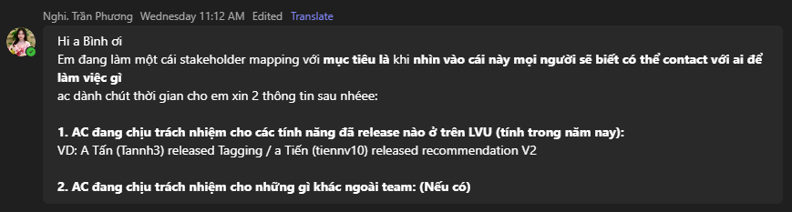
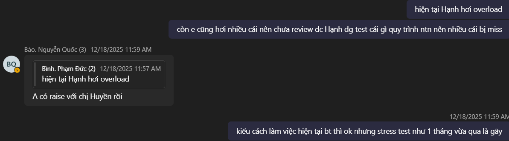

# LVU Proposal (Part 1)

---
---

# Problem Statement

Previous ways of working no longer works.

<v-click>

Level Up started with just **Bình, Huy và Bảo** as the dev team — we deemphasized "metawork".

</v-click>
<v-click>

Managing Jira tickets is an afterthought. We had agility without following "corporate" Agile 

</v-click>
<v-click>

But now that Level Up has grown to **8 devs, 1 QA and 3 PMs**, we need to do it to help us improve:

</v-click>

  <v-click>
👁️ Visibility
</v-click>
  <v-click>
📏 Measurability
</v-click>
  <v-click>
🙋 Responsibility
</v-click>

<v-click>

  💡 My proposal: start taking Jira Tickets seriously

</v-click>

<v-click>

Let's break those down one by one

</v-click>
---

# Level Up efforts are not visible

<v-click>

- Who is doing what?

</v-click>
<v-click>

- What's the progress of each task?

</v-click>
<v-click>

- Who do PMs call when there's a problem with a feature?

</v-click>

  

---

# Level Up efforts are not measurable

<v-click>

- Are we overloading? OTing? or just "chill chill"?

</v-click>

<v-click>

- BaoNQ3 & BaoNT7 usually put in requirements mid sprint. Resulting in "Scope Explosion" 

</v-click>

<v-click>

This results in
- "I love coding but let's not do that again" 
- "Tối nay e rảnh e ra quán cf test"
- "E phải ra quán cf download vì mạng e chậm và họ gửi build muộn"
 
</v-click>

<v-click>
  
</v-click>

<v-click>

- With nothing measurable, every Performance Review comes down to your boss's impression of you

</v-click>
<v-click>

- After we apply AI, how do we know who's using it effectively? 

</v-click>

---

# Level Up is too burnt out to be responsible

<v-click>

- Release timeline is delayed without proper communication.

</v-click>
<v-click>

- "A làm xong r đó Hạnh test đi"
</v-click>
<v-click>

- 1 QA is responsible for validating ALL features, some of which she doesn't fully understand — leads to burnout, fatigue from context switching, and not enough time for edge cases and prioritization

</v-click>
<v-click>

- Only people with "important items" are mentioned in daily meetings. Khi mà hỏi là còn ai còn gì nữa k tất nhiên là k ai trả lời

</v-click>

---
layout: center
class: text-center
---

# Tất cả tại workflow

The company actually has a great workflow, let's follow that

---

# Workflow Chế

The main changes are: 
- PM/Teamlead should always create tickets when they want something done. Mid-sprint Tickets should almost always be put into the next sprint
- QA starts writing test cases right after ticket creation. 
- QA is only responsible for managing test cases, and join demos to QA. Only manual test when really necessary 
- The whole team should play poker to estimate story points 
- Devs should always update tickets promptly. U can use Claude for this
- Devs are responsible for demoing their own features/APIs, explain feature mechanics and prove that the tracking implementation works
- "Real" daily meeting: What is my progress on X, what i'm planning to do, what is my blocker, will i be late for release?

---

# Every decision has a trade-off 
This workflow is not without its cons 

- People usually resist changes 
- More "metawork", may result in more meeting time than coding time => needs facilitator
- Require PMs to write tickets carefully and adequately
- Please give inputs

<!-- --- -->
<!-- layout: center -->
<!-- class: text-center -->
<!-- --- -->
<!-- # AI adoption(Part 2) -->

--- 
